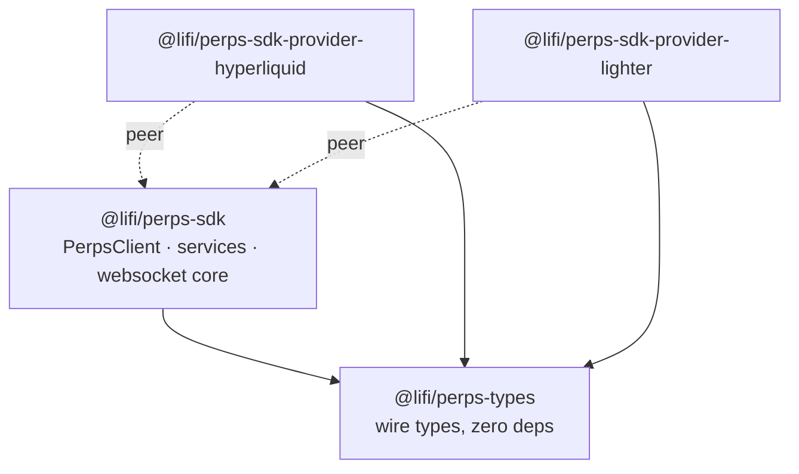
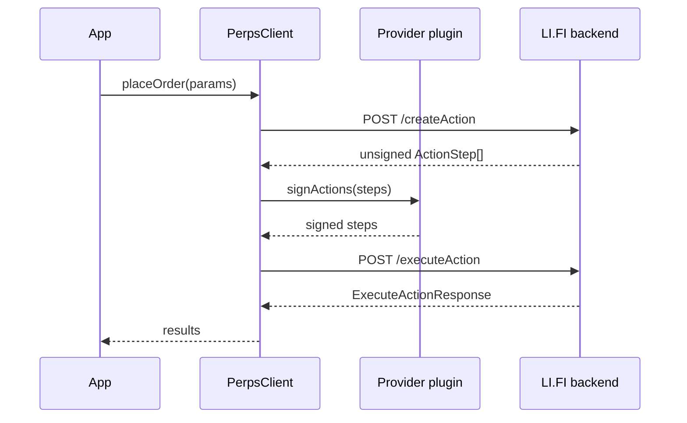
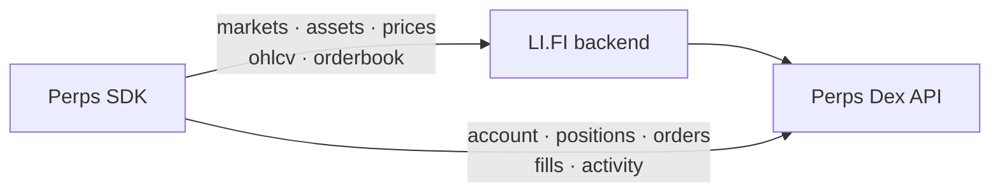
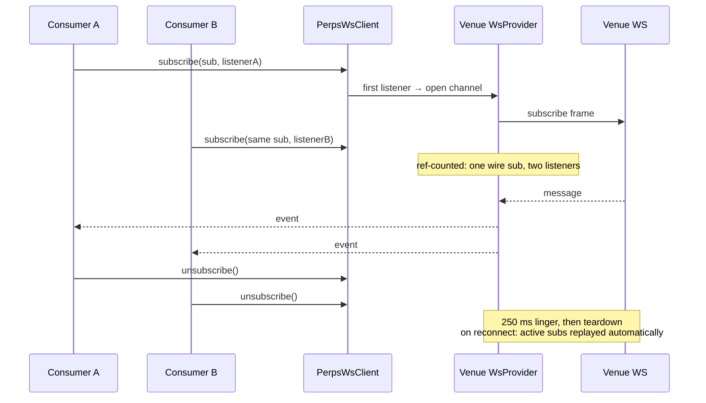

<div align="center">

[](/LICENSE)
[](https://www.npmjs.com/package/@lifi/perps-sdk)
[](https://www.npmjs.com/package/@lifi/perps-sdk)
[](https://twitter.com/lifiprotocol)

</div>

<h1 align="center">LI.FI Perps SDK</h1>

[**LI.FI Perps SDK**](https://public-perps-docs.mintlify.app/) is a TypeScript SDK for trading perpetuals across multiple DEXes through one unified interface.

- **Unified API** across perpetual DEXes (Hyperliquid, Lighter).
- **Provider plugins** — each DEX ships as a separate package you register on the client.
- **Agent-based signing** — trades execute without per-order wallet popups (one-time wallet signature during setup).
- **Two layers** — low-level service functions and the high-level `PerpsClient`.
- **Realtime** — WebSocket subscriptions for prices, orderbook, and fills.
- **Fully typed** — all types exported, sourced from `@lifi/perps-types`.

## Packages

A pnpm + Changesets monorepo. Published packages live under [`packages/`](./packages):

| Package | Install for | Description |
| --- | --- | --- |
| [`@lifi/perps-sdk`](./packages/perps-sdk) | every project | Core SDK — `PerpsClient`, service functions, realtime client |
| [`@lifi/perps-sdk-provider-hyperliquid`](./packages/perps-sdk-provider-hyperliquid) | Hyperliquid | Hyperliquid provider plugin |
| [`@lifi/perps-sdk-provider-lighter`](./packages/perps-sdk-provider-lighter) | Lighter | Lighter provider plugin |
| [`@lifi/perps-types`](./packages/perps-types) | (transitive) | Shared types; re-exported from `@lifi/perps-sdk` |

## Installation

Install the core SDK plus the provider plugin(s) for the DEX(es) you target:

```bash
pnpm add @lifi/perps-sdk @lifi/perps-sdk-provider-hyperliquid
# or
npm install @lifi/perps-sdk @lifi/perps-sdk-provider-hyperliquid
```

Get an API key from the [LI.FI Partner Portal](https://portal.li.fi/).

## Gotchas

- **Register every provider plugin on the client.** The core SDK ships no DEX
  logic — pass the plugins via the `providers` option (`hyperliquidProvider()`,
  `lighterProvider()`) or a call to any provider-specific service throws.
- **Setup needs a one-time wallet signature.** `placeOrder` signs with a
  per-user agent, not the wallet. Run `checkSetup` and complete the returned
  steps (one user-signed step provisions the agent) before trading; `isReady`
  flips `true` once everything is satisfied.
- **Markets are referenced by opaque `marketId`, not display symbol.** A
  `MarketRef` is `{ marketId, categoryId }` where `marketId` is `Market.id`
  from `getMarkets` — not a string like `'BTC'`. The same applies to the
  `marketIds` filter on `getMarkets` / `getPrices`.
- **Linking locally? `pnpm build` the package first.** Consumers wiring this
  SDK via a `link:` path resolve `dist/`, not `src/`. Source edits are invisible
  until you rebuild — you silently get stale `dist/`.

## Architecture

### Package layering

`@lifi/perps-types` is a zero-dependency wire-type package at the base. The core `@lifi/perps-sdk` depends on it. Each provider plugin depends on `@lifi/perps-types` directly and takes the core SDK as a peer dependency — so your project installs exactly one copy of the SDK.



### Action lifecycle

Every mutating action (order placement, cancellation, withdrawal, setup) follows the same pipeline. The developer experience is one wallet signature at setup time — the agent provisioned during setup signs all subsequent orders automatically, with no per-order wallet popups.



### Data-plane split

Market-structure reads go through the LI.FI backend, which fans out to each venue on your behalf. Per-user reads (account state, positions, orders, fills, activity) go from the SDK directly to the venue API using the end-user's own IP — this keeps venue rate limits per-user rather than concentrating them on the backend's single egress address.



## Quick Start

### Fetch market data

```typescript
import { createPerpsClient, getProviders, getMarkets, getPrices } from '@lifi/perps-sdk'

const client = createPerpsClient({ integrator: 'my-app', apiKey: 'your-api-key' })

// getProviders returns the live provider list; provider: takes a key string
// like 'hyperliquid' or 'lighter'.
const { providers } = await getProviders(client)
const { markets } = await getMarkets(client, { provider: providers[0].key })
const { prices } = await getPrices(client, {
  provider: 'hyperliquid',
  marketIds: markets.slice(0, 2).map((m) => m.id),
})
```

### Trade with PerpsClient

Register the provider plugin(s), run the one-time setup flow, then place orders:

```typescript
import { PerpsClient, OrderSide, OrderType } from '@lifi/perps-sdk'
import { hyperliquidProvider } from '@lifi/perps-sdk-provider-hyperliquid'

const perps = new PerpsClient({
  integrator: 'my-app',
  apiKey: 'your-api-key',
  providers: [hyperliquidProvider()],
})

// One-time setup: provisions the signing agent and reports any steps still
// needing the user's wallet signature. isReady === true once satisfied.
const setup = await perps.checkSetup({ provider: 'hyperliquid', address })

// Resolve the market to trade from getMarkets, then place the order — the
// agent signs automatically, no wallet popups.
const result = await perps.placeOrder({
  provider: 'hyperliquid',
  address,
  market: { marketId: market.id, categoryId: market.categoryId },
  side: OrderSide.BUY,
  type: OrderType.MARKET,
  size: '0.1',
  price: '95000.00',
})
```

See [`examples/agent-trading.ts`](./examples/agent-trading.ts) for the full setup
flow, including signing the user-gated steps.

### Venue-correct order formatting

Tick/lot rules and margin models differ per venue, so price/size formatting and
liquidation previews are provider methods — always route them through the
market's own provider rather than applying one venue's rules to another's
markets:

```typescript
const provider = perps.client.getProvider(market.providerId)!
const price = provider.formatOrderPrice(market, 95000.25)
const size = provider.formatOrderSize(market, 0.123456)
const liq = provider.estimateLiquidationPrice(market, {
  entryPrice: 95000,
  leverage: 10,
  isLong: true,
}) // number, or undefined when the venue model can't be evaluated client-side
```

## Realtime (WebSocket)

`PerpsWsClient` from `@lifi/perps-sdk` is the realtime layer. It lazily
creates one socket per provider on first subscribe, then fans events out to
all listeners.

### Construction

```typescript
import { PerpsWsClient, createPerpsClient } from '@lifi/perps-sdk'
import { hyperliquidWsProvider } from '@lifi/perps-sdk-provider-hyperliquid'
import { lighterWsProvider } from '@lifi/perps-sdk-provider-lighter'

const client = createPerpsClient({ integrator: 'my-app', apiKey: 'your-api-key' })

const ws = new PerpsWsClient(client, {
  wsProviders: {
    hyperliquid: hyperliquidWsProvider(),
    lighter: lighterWsProvider({
      // Required for authenticated Lighter channels (orderUpdates, positions).
      // authProvider: (address) => myPlugin.resolveAuthToken(address),
    }),
  },
})
```

`wsProviders` is a map of provider key → `WsProviderFactory`. Factories for
Hyperliquid and Lighter ship in their respective provider packages. Subscribing
to a key that has no registered factory throws a `PerpsError`.

### Subscribing

```typescript
const unsubscribe = await ws.subscribe(
  { channel: 'prices', dex: 'hyperliquid' },
  (event) => {
    // event.data: Record<string, string> — Market.id → last-trade price
    console.log(event.data)
  },
  (status) => {
    // Optional status listener: 'connected' | 'reconnecting' | 'disconnected'
    console.log('WS status:', status)
  }
)

// Unsubscribe when done.
unsubscribe()
```

`subscribe` returns a `Promise<() => void>`. Calling the returned function
releases the listener; the underlying socket stays open until no listeners
remain.

### Consumer contract — subscribe per consumer, the SDK dedupes

**Do not deduplicate subscriptions yourself.** Multiple components or hooks
may call `subscribe()` for the same channel independently. The SDK
ref-counts listeners onto one wire subscription per channel key, and fans
each inbound event out to every listener. A listener that throws is
isolated — it does not prevent the others from receiving the event.

```typescript
// Two independent subscribers on the same channel — one wire subscription.
const unsubA = await ws.subscribe({ channel: 'prices', dex: 'hyperliquid' }, listenerA)
const unsubB = await ws.subscribe({ channel: 'prices', dex: 'hyperliquid' }, listenerB)
```

### Subscription lifecycle



**Linger on teardown.** When the last listener releases, the SDK waits
250 ms (`WS_CHANNEL_TEARDOWN_LINGER_MS`) before sending the unsubscribe
frame. A re-subscribe within that window cancels the pending teardown, so
React StrictMode's synchronous unmount→remount cycle does not cause a
subscribe→unsubscribe→subscribe round trip on the venue.

### Reconnect semantics

`ReconnectingWebSocket` auto-reconnects with jittered exponential backoff
(default: up to 10 attempts, roughly 20–60 s). On every (re)open, active
subscriptions are replayed automatically — consumers do nothing. The optional
`onStatus` callback passed to `subscribe()` fires through each transition:

| Status | Meaning |
|---|---|
| `connected` | Socket open, live data flowing. |
| `reconnecting` | Transient drop; backoff reconnect in progress. Data may be stale. |
| `disconnected` | Retry budget exhausted. Terminal. Call `ws.reconnect(provider)` to restart. |

### Authenticated Lighter channels

Lighter's account-scoped channels (`orderUpdates`, `positions`) require an
auth token on the subscribe frame. Pass an `authProvider` to
`lighterWsProvider()`:

```typescript
lighter: lighterWsProvider({
  authProvider: (address) => myPlugin.resolveAuthToken(address),
})
```

`authProvider` is called fresh on every subscribe send — including reconnects
— so stale tokens are never replayed. Without an `authProvider`, subscribing
to `orderUpdates` or `positions` throws at subscribe time.

`fills` (`account_all_trades`) is publicly readable on Lighter and does not
require a token.

### Available channels

| Channel | `dex` field | Auth required | Event `data` shape |
|---|---|---|---|
| `prices` | any | No | `Record<string, string>` — `Market.id → price` |
| `orderbook` | any | No | `OrderbookResponse` (bids/asks with price+size) |
| `candle` | `hyperliquid` | No | `Candle` (OHLCV bar) |
| `orderUpdates` | any | Lighter only | `{ openOrders, triggerOrders, terminated }` |
| `fills` | any | No | `Fill[]` |
| `positions` | any | Lighter only | `Position[]` — full open-position snapshot |
| `spotBalances` | `hyperliquid` | No | `(Balance & { locked })[]` |

`positions` events carry the **full** open-position set for the subscribed
address — consumers replace their state rather than merging.

### Closing

```typescript
ws.close() // closes all open sockets and drops all cached providers
```

## Examples

Runnable scripts in [`examples/`](./examples):

| Script | What it shows |
| --- | --- |
| [`market-data.ts`](./examples/market-data.ts) | Fetching markets, assets, prices, orderbook, OHLCV |
| [`account-data.ts`](./examples/account-data.ts) | Account state, positions, orders, fills |
| [`agent-trading.ts`](./examples/agent-trading.ts) | Full setup flow + placing and cancelling orders |
| [`error-handling.ts`](./examples/error-handling.ts) | Handling `PerpsError` codes and retries |
| [`custom-storage.ts`](./examples/custom-storage.ts) | Plugging in a custom credential store |
| [`websocket-subscriptions.ts`](./examples/websocket-subscriptions.ts) | Realtime prices, orderbook, multi-listener dedup, status |

## Development

pnpm workspace. From the repository root:

| Command | Does |
| --- | --- |
| `pnpm install` | Install workspace dependencies |
| `pnpm build` | Build every package (CJS + ESM + types) |
| `pnpm test` | Run all package tests (vitest) |
| `pnpm test:unit` | Unit tests only |
| `pnpm test:cov` | Tests with coverage |
| `pnpm check` | Biome lint/format check |
| `pnpm check:write` | Biome auto-fix |
| `pnpm check:types` | TypeScript type checking across packages |
| `pnpm check:circular-deps` | madge circular-dependency check |
| `pnpm knip:check` | Report unused files, deps, and exports |

## Releasing

Releases are driven by [Changesets](https://github.com/changesets/changesets) and
published from CI only — npm auth uses OIDC trusted publishing bound to
`.github/workflows/publish.yaml`, so you cannot publish from a local machine.

**Every change that should ship needs a changeset.** Run `pnpm changeset` on your
branch, pick the affected packages and bump levels, and commit the generated
`.changeset/*.md` file with your PR.

### Stable releases (`latest`)

1. Land your PR (with its changeset) on `main`.
2. CI opens/refreshes a **"chore: version packages"** PR that applies the pending
   changesets — bumping versions and updating each `CHANGELOG.md`.
3. Merge that PR. CI publishes every bumped package to npm under the `latest`
   dist-tag and creates the GitHub Releases.

A stable version can only be cut by merging to `main` — there is no branch-based
shortcut.

### Preview releases (`preview` dist-tag)

To publish a real, installable build of in-progress work **without merging to
`main`** — and without messy local `link:`/`file:` overrides — add the
**`release-preview`** label to an open PR. CI snapshot-publishes the PR's packages
as `0.0.0-preview-<sha>` under the `preview` dist-tag and comments the exact
install commands on the PR. The PR must contain a changeset (that's what marks
which packages to publish).

```bash
# install a specific preview build (recommended — pin the exact version)
npm i @lifi/perps-sdk@0.0.0-preview-<sha>

# or track the newest preview across PRs (the @preview tag moves)
npm i @lifi/perps-sdk@preview
```

A `0.0.0-preview-*` version can never become `latest`. The label is removed
automatically after a successful publish — re-add it to publish a new snapshot
after pushing more commits.

## Documentation

- [Full documentation](https://public-perps-docs.mintlify.app/)
- [API reference](https://public-perps-docs.mintlify.app/api-reference)
- [Changelog](./CHANGELOG.md)
</content>
</invoke>
