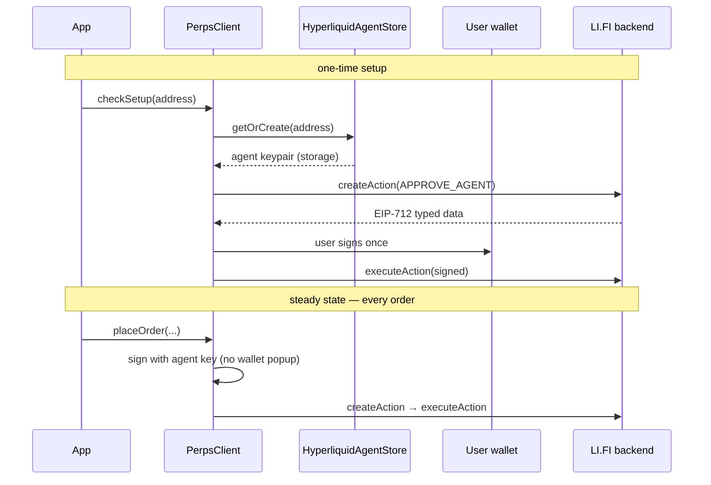

# `@lifi/perps-sdk-provider-hyperliquid`

Hyperliquid provider plugin for the [LI.FI Perps SDK](../../README.md).

## Installation

```bash
pnpm add @lifi/perps-sdk @lifi/perps-sdk-provider-hyperliquid
# or
npm install @lifi/perps-sdk @lifi/perps-sdk-provider-hyperliquid
```

## Registration

Pass `hyperliquidProvider()` to `createPerpsClient` (or `PerpsClient`):

```ts
import { createPerpsClient } from '@lifi/perps-sdk'
import { hyperliquidProvider } from '@lifi/perps-sdk-provider-hyperliquid'

const client = createPerpsClient({
  integrator: 'my-app',
  apiKey: 'your-api-key',
  providers: [hyperliquidProvider()],
})
```

## Agent keypair concept

Hyperliquid requires every trading action to be signed by a designated **agent wallet** — a fresh EVM keypair the user authorises once. The provider generates this keypair client-side, stores it locally via `HyperliquidAgentStore`, and presents only its address to the backend during setup. The user's own wallet signs a single `APPROVE_AGENT` EIP-712 message; from that point all orders sign with the agent key with no further wallet prompts.

The agent private key never leaves the client and is never sent to the LI.FI backend. It is a session-level signing credential, not a custody key — the user's funds always remain under their L1 address.

## Setup flow

Call `checkSetup` before trading. It reports any unsatisfied setup steps and an `isReady` flag. For a fresh address the only required step is `APPROVE_AGENT`, which is signed by the user's wallet (`PerpsSigner.USER`). After that step is executed, all subsequent orders sign automatically with the agent key (`PerpsSigner.AGENT`) and require no wallet interaction.

```ts
import { PerpsClient } from '@lifi/perps-sdk'
import { hyperliquidProvider } from '@lifi/perps-sdk-provider-hyperliquid'
import type { Account, Chain, Transport, WalletClient } from 'viem'

const perps = new PerpsClient({
  integrator: 'my-app',
  apiKey: 'your-api-key',
  providers: [hyperliquidProvider()],
})

// Provide the user's wallet for the one USER-signed step.
perps.setUserWallet(walletClient)

const setup = await perps.checkSetup({ provider: 'hyperliquid', address })

if (!setup.isReady) {
  const signedActions = await Promise.all(
    setup.setup.map((step) =>
      perps.signProviderSetupAction('hyperliquid', address, step)
    )
  )
  await perps.executeProviderSetup({
    provider: 'hyperliquid',
    address,
    setup: setup.setup,
    signedActions,
  })
}

// All orders now sign with the agent key automatically.
await perps.placeOrder({ provider: 'hyperliquid', address, ... })

declare const walletClient: WalletClient<Transport, Chain, Account>
```

See [`examples/agent-trading.ts`](../../examples/agent-trading.ts) for the full flow, including market resolution and order placement.

### Sequence diagram



## Storage

By default the agent keypair is persisted in browser `localStorage` under the key:

```
lifi-perps-agent:<userAddress (lowercased)>:hyperliquid
```

If storage is cleared or the app moves to a new browser or device, the keypair is gone and `checkSetup` will report setup as required again. Re-running the setup flow issues a new keypair and `APPROVE_AGENT` signature — no funds are at risk; the previous agent key simply loses its authorisation.

To use a different storage backend (SSR, encrypted storage, in-memory testing), pass a custom [`StorageAdapter`](../../examples/custom-storage.ts) to `hyperliquidProvider`:

```ts
hyperliquidProvider({
  storage: {
    get: async (key) => myStore.get(key) ?? null,
    set: async (key, value) => { myStore.set(key, value) },
    remove: async (key) => { myStore.delete(key) },
  },
})
```

See [`examples/custom-storage.ts`](../../examples/custom-storage.ts) for a complete example.

## Signing

| Action class | Signed by | Examples |
|---|---|---|
| Trading actions (orders, cancels, leverage) | `PerpsSigner.AGENT` — agent key, no wallet prompt | `placeOrder`, `cancelOrders`, `updateLeverage` |
| Setup / account actions | `PerpsSigner.USER` — user wallet | `APPROVE_AGENT`, withdrawals |

The provider handles signer dispatch internally. Applications do not call signing functions directly.

## Agent expiry

Hyperliquid agents carry an optional TTL (`agentTtlMs` on `ApproveAgentParams`). When an agent expires, the provider's signing will fail and `checkSetup` will report setup as required for that address again. Completing the setup flow issues and approves a new agent keypair. No funds are affected; only trading authorisation lapses.

## Exported surface

```ts
import {
  // Factory and provider types
  hyperliquidProvider,           // (): HyperliquidPerpsProvider
  type HyperliquidPerpsProvider, // extends PerpsProviderPlugin; agent lifecycle methods
  type HyperliquidProviderOptions,

  // Agent store (direct use is optional — the provider manages it automatically)
  HyperliquidAgentStore,
  type HyperliquidAgent,         // { address: Address; privateKey: Hex }

  // WebSocket provider
  HyperliquidWsProvider,
  hyperliquidWsProvider,

  // Service functions (low-level, provider-agnostic callers)
  getAccount,
  getPositions,
  getOrders,
  getOrder,
  getFills,
  getActivity,

  // Account utilities
  projectHyperliquidConfigSettings,
  getAccountSummary,

  // Constants
  DEFAULT_HYPERLIQUID_API_URL,
  HYPERLIQUID_FEE_TIER_FALLBACK,
  HYPERLIQUID_PROVIDER_KEY,
} from '@lifi/perps-sdk-provider-hyperliquid'
```

`HyperliquidPerpsProvider` adds three agent-lifecycle methods on top of the base `PerpsProviderPlugin` contract: `getAgentAddress`, `hasAgent`, and `removeAgent`. Use them to surface a "revoke agent" affordance or to inspect agent state; routine trading does not need them.

For the generic `create → sign → execute` action lifecycle, see the [root README](../../README.md).
