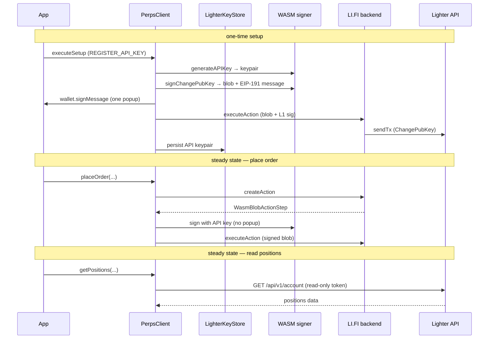

# `@lifi/perps-sdk-provider-lighter`

Lighter provider plugin for [`@lifi/perps-sdk`](../../README.md). Registers a `PerpsProviderPlugin` that routes Lighter reads directly to the Lighter REST API (no LI.FI backend hop per read), and handles all Lighter signing via a bundled Go WASM signer.

> **`marketId` is numeric.** Lighter's `Market.id` is a numeric string (`"0"`, `"1"`, …). Never pass a display string such as `"LIT/USDC"` where a `marketId` is expected — it will silently produce `NaN` and requests will fail.

## Installation

```bash
pnpm add @lifi/perps-sdk @lifi/perps-sdk-provider-lighter
# or
npm install @lifi/perps-sdk @lifi/perps-sdk-provider-lighter
```

## Registration

```ts
import { createPerpsClient, localStorageAdapter } from '@lifi/perps-sdk'
import {
  LighterKeyStore,
  LighterSigner,
  lighterProvider,
} from '@lifi/perps-sdk-provider-lighter'

const client = createPerpsClient({
  integrator: 'my-app',
  apiKey: 'your-lifi-api-key',
  providers: [
    lighterProvider({
      signer: new LighterSigner(),
      keyStore: new LighterKeyStore(localStorageAdapter),
      readOnlyTokenOptions: { storage: localStorageAdapter },
    }),
  ],
})
```

### Loading WASM in a Vite/browser project

The `LighterSigner` bundles `lighter-signer.wasm` and `wasm_exec.js` alongside its `dist/`. In a Vite project you must import these assets so Vite serves them correctly — otherwise the IIFE that installs `globalThis.Go` may be transformed and break:

```ts
import lighterWasmUrl from '@lifi/perps-sdk-provider-lighter/wasm/lighter-signer.wasm?url'
import lighterWasmExecSource from '@lifi/perps-sdk-provider-lighter/wasm/wasm_exec.js?raw'

const signer = new LighterSigner({
  wasmBinaryUrl: lighterWasmUrl,
  wasmExecJsSource: lighterWasmExecSource,
})
```

In Node.js the default asset paths resolve correctly from `dist/` without any overrides.

## Token model

Lighter uses two distinct bearer tokens for different purposes. Both flow through `LighterProviderOptions` and are managed automatically once `signer` and `keyStore` are configured.

### Standard auth token

- **Created by:** the WASM signer (`LighterSigner.createAuthToken`), signed with the user's registered Lighter API key — no wallet popup.
- **Lifetime:** up to 8 hours (Lighter's hard cap). The SDK defaults to 1-hour tokens and re-creates one when the remaining life falls below 60 seconds.
- **Used for:** authenticated writes (via `signActions`) and as the credential that authorises read-only token creation on first use.

### Read-only token

- **Created at:** first authenticated read after setup, via Lighter's `POST /api/v1/tokens/create`, authorised by a standard auth token.
- **Lifetime:** up to 10 years (Lighter's maximum). The SDK requests this maximum so the token covers the account's lifetime. One warning: `LighterReadOnlyTokenManager.isReadOnlyTokenExpiringSoon` can alert the consumer when fewer than 30 days remain.
- **Used for:** all authenticated reads (`getOrders`, `getOrder`, `getActivity`, `getAccount` fee tier, etc.) that go directly to the Lighter API — no LI.FI backend hop.
- **Scope:** `all` (reads across all sub-accounts of the owner).
- **Stored by:** `LighterReadOnlyTokenManager`, keyed on `(l1Address, accountIndex)`, using the `StorageAdapter` passed in `readOnlyTokenOptions.storage`.

Per-user reads go **direct to the Lighter API** (not through the LI.FI backend). The backend is involved only in the create/execute action pipeline for writes.

### Token resolution order for authenticated reads

When a read requires authentication the provider tries these sources in order and uses the first that produces a token:

1. Per-call `options.lighterAuthToken`
2. Constructor `authToken` string or factory
3. Stored read-only token (from `LighterReadOnlyTokenManager`)
4. Freshly created read-only token (authorised by a standard token created from the registered API key)
5. Standard auth token (fallback if read-only token creation fails)

When no source produces a token, `getOrders` and `getActivity` return empty results, `getOrder` throws `Unauthorized`, and `getAccount` returns a zero fee tier.

## One-time setup flow

Before trading, the user's Ethereum address must be registered on Lighter's L2 with a Lighter-native API keypair. The `PerpsClient.checkSetup` / `PerpsClient.executeSetup` flow handles this. The Lighter-specific steps are:

1. **`REGISTER_API_KEY`** — the WASM signer generates a fresh Lighter keypair (`GenerateAPIKey`), produces a `ChangePubKey` transaction blob, and requests an EIP-191 `signMessage` from the user's L1 wallet (one wallet popup, first time only). The L1 signature is embedded into the blob and submitted. The keypair is then persisted in `LighterKeyStore`.

2. Subsequent write operations (place order, cancel, modify, withdraw, etc.) are signed with the stored API key via the WASM signer — no further wallet popups.

For the generic `checkSetup → executeSetup` lifecycle, see the [root README](../../README.md).



## WASM signer

The package bundles two assets under `wasm/`:

- `lighter-signer.wasm` — the Go WASM binary that signs Lighter transactions and creates auth tokens.
- `wasm_exec.js` — Go's runtime shim that installs the `globalThis.Go` class and registers polyfills.

The WASM provides: key generation (`GenerateAPIKey`), API-key client registration (`CreateClient`), auth-token creation (`CreateAuthToken`), and all transaction signing operations (`SignCreateOrder`, `SignCancelOrder`, `SignModifyOrder`, `SignWithdraw`, `SignTransfer`, `SignUpdateLeverage`, `SignUpdateMargin`, `SignChangePubKey`).

`loadLighterWasm` is memoized per process — the Go runtime starts a long-running goroutine on first load and is never stopped.

`LighterSigner` calls `loadLighterWasm` automatically on first use; you do not need to call `initialize()` explicitly.

## Storage

`LighterKeyStore` persists the user's Lighter API keypair (private key, public key, `accountIndex`, `apiKeyIndex`) under the key `lifi-perps-lighter-key:<address>`.

`LighterReadOnlyTokenManager` persists the read-only token under `lifi:perps:lighter:rotoken:<address>:<accountIndex>`.

Both accept any `StorageAdapter` — an interface from `@lifi/perps-sdk` with `get`, `set`, and `remove` methods. The SDK ships `localStorageAdapter` for browsers. Pass a custom adapter for server-side or React Native environments.

**Recovery when storage is lost:** re-run `executeSetup`. For `REGISTER_API_KEY` specifically — the backend checks whether the public key you hold matches the one registered on-chain. If storage was wiped but the on-chain slot matches a freshly generated key, setup re-completes transparently. No funds are at risk; the API keypair authorises signing only, not asset custody.

## Multi-account

Lighter uses a numeric `accountIndex` (looked up once from the user's L1 Ethereum address via Lighter's REST) and an `apiKeyIndex` for the API key slot. The SDK uses `accountIndex` 0-based (the primary account) and defaults to `apiKeyIndex` 42 (`DEFAULT_API_KEY_INDEX`), chosen to avoid colliding with Lighter's reserved desktop/mobile slots (0–3).

The SDK exposes `accountIndex` and `apiKeyIndex` as fields on `LighterApiKey` (what `LighterKeyStore` stores) and on `LighterAccountConfig` (what `getAccount` returns under `AccountResponse.config`). Sub-account switching is not directly supported beyond this — the SDK operates on the primary account for a given L1 address.

## Exported surface

The main exports from `@lifi/perps-sdk-provider-lighter`:

| Export | Kind | Purpose |
|---|---|---|
| `lighterProvider` / `Lighter` | factory | Creates the `LighterPerpsProvider` plugin for `createPerpsClient` |
| `LighterSigner` | class | WASM-backed signer for key generation, signing, and auth-token creation |
| `LighterKeyStore` | class | Persists the user's Lighter API keypair |
| `LighterReadOnlyTokenManager` | class | Creates and persists the long-lived read-only bearer token |
| `createAuthToken` | function | Creates a fresh standard auth token from an API key + signer |
| `isReadOnlyTokenExpiringSoon` | function | Returns `true` when the stored read-only token expires within a threshold |
| `loadLighterWasm` | function | Loads the WASM binary (memoized) |
| `LighterWsProvider` / `lighterWsProvider` | class / factory | Realtime WebSocket provider (orderbook, prices, orders, fills, positions) |
| `LighterPerpsProvider` | interface | Extended `PerpsProviderPlugin` with `resolveAuthToken` — used by the WS layer |
| `LighterProviderOptions` | interface | Constructor options for `lighterProvider(...)` |
| `LighterApiKey` | interface | Shape stored by `LighterKeyStore` |
| `LighterReadOnlyToken` | interface | Shape stored by `LighterReadOnlyTokenManager` |
| `DEFAULT_API_KEY_INDEX` | constant | `42` — the LI.FI-assigned API key slot |
| `DEFAULT_LIGHTER_REST_URL` | constant | Lighter mainnet REST base URL |
| `LIGHTER_PROVIDER_KEY` | constant | `"lighter"` — the provider key used on `Market.categoryId` |
